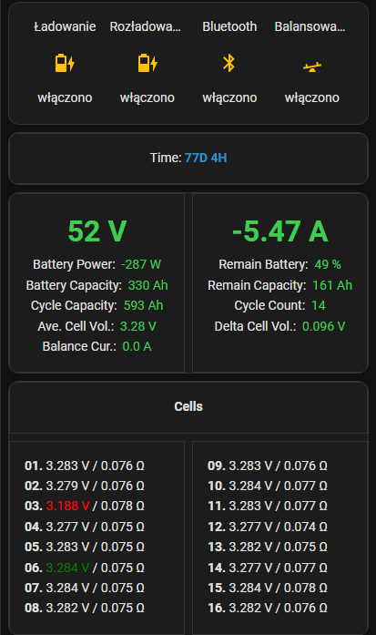
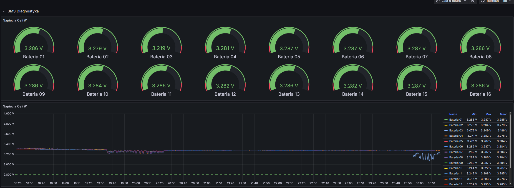
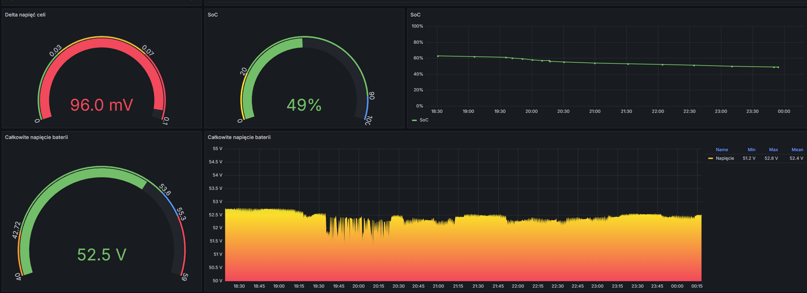
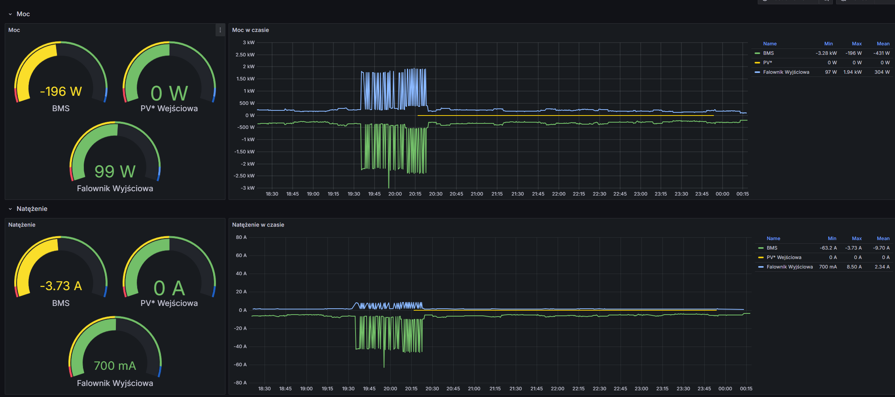
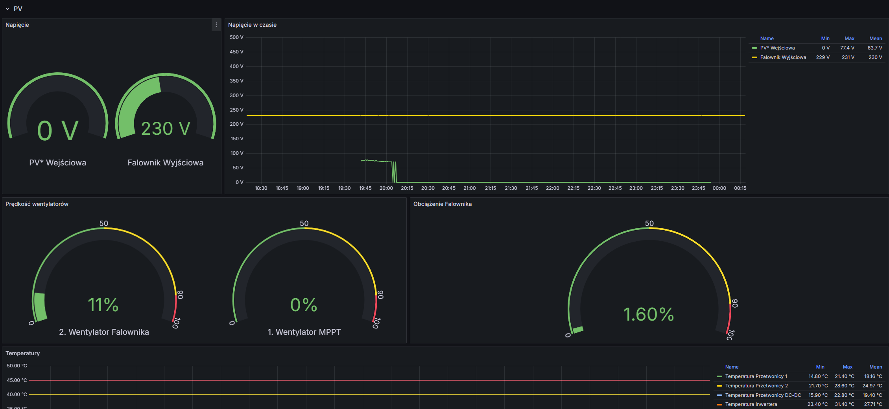

# Growatt + JK-BMS ESPHome Configurations

This repository contains ready-to-use ESPHome configurations for monitoring and integrating a **JK-BMS** and a **Growatt inverter**.

* **`jk-bms.yaml`** — Connects to a JK-BMS via BLE using the community component.
* **`growatt.yaml`** — Reads Growatt inverter data over Modbus UART.
* **`combined.yml`** — Combines both BLE (JK-BMS) and Modbus (Growatt) in one firmware.

> **Note:** The JK-BMS component used here is from [syssi/esphome-jk-bms](https://github.com/syssi/esphome-jk-bms).

These configurations expose numerous entities (sensors, binary sensors, text sensors, switches, etc.) for seamless integration with **Home Assistant** using **ESPHome**.

---

## Quick Facts

* **Platform:** ESP32 (`esp32dev`)
* **Minimum ESPHome version:** As specified in each YAML (e.g., `2024.6.0`)
* **External component:** `syssi/esphome-jk-bms`
* **Growatt communication:** Modbus over UART
  Default: TX → GPIO16, RX → GPIO17, Baud rate → 9600

---

## Before Flashing — Update These Settings

1. **Wi-Fi credentials**
   Add `wifi_ssid` and `wifi_password` to your `secrets.yaml`, or replace them directly (not recommended).

2. **BMS MAC address and protocol version**
   Edit substitutions in `jk-bms.yaml` or `combined.yml`:

   ```yaml
   substitutions:
     bms0_mac_address: 'AA:BB:CC:DD:EE:FF'
     bms0_protocol_version: 'JK02_32S'
   ```

3. **Modbus / UART settings**
   Ensure UART pins and baud rate match your physical Growatt inverter connection.

4. **External components**
   The JK-BMS component is included via:

   ```yaml
   external_components:
     - source: github://syssi/esphome-jk-bms@main
   ```

   You may pin a specific version tag if desired.

---

## File Overview

### `jk-bms.yaml`

* BLE client for JK-BMS (via syssi component)
* Sensors: cell voltages, resistances, current, temperatures, SOC, energy, etc.
* Includes status LED, buttons, and energy counters

### `growatt.yaml`

* Modbus controller for Growatt inverter registers
* Sensors: AC power, voltage, current, frequency, temperature, PV energy, battery, fan speed, etc.
* LED indicators for Wi-Fi and API connection status

### `combined.yml`

* Combines both BMS (BLE) and inverter (Modbus) monitoring in one ESPHome firmware

---

## Lovelace Dashboard Example

Example Lovelace cards compatible with these YAMLs, based on [syssi/esphome-jk-bms discussion #230](https://github.com/syssi/esphome-jk-bms/discussions/230):



---

## Grafana Integration

You can log and visualize data using **InfluxDB** + **Grafana**:






---

## Notes and Best Practices

* Always back up your current configurations before editing.
* Test each module separately before using `combined.yml`.
* OTA updates may temporarily disable BLE connections (see `ota.on_begin` logic).
* For debugging, increase logging:

  ```yaml
  logger:
    level: DEBUG
  ```

  and check ESPHome logs for detailed output.
